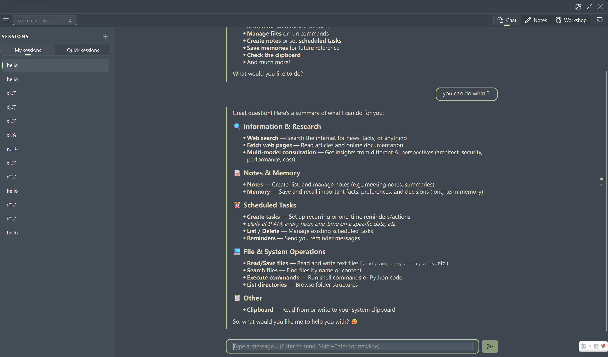
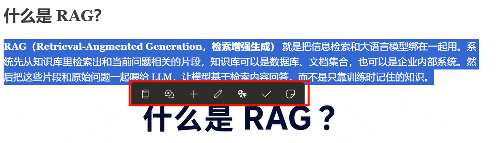
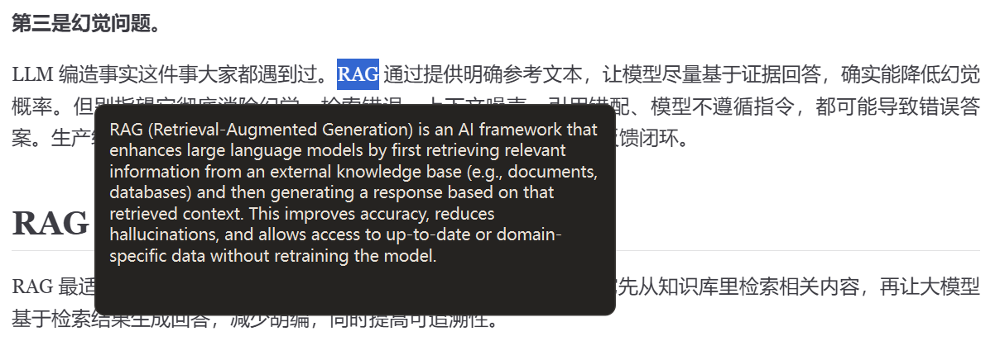
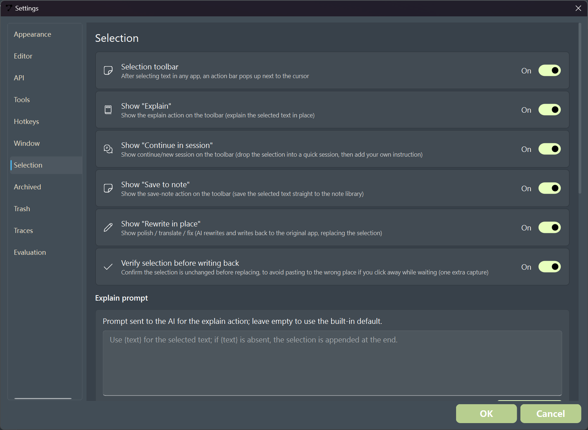
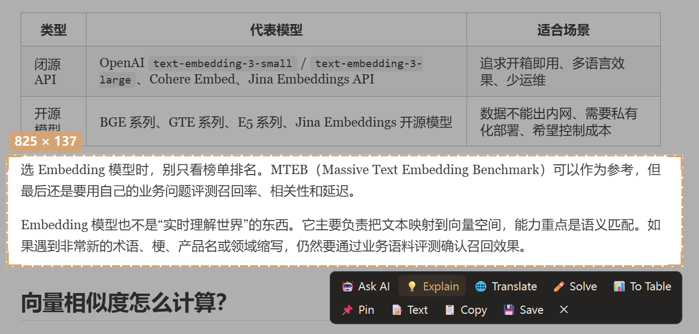
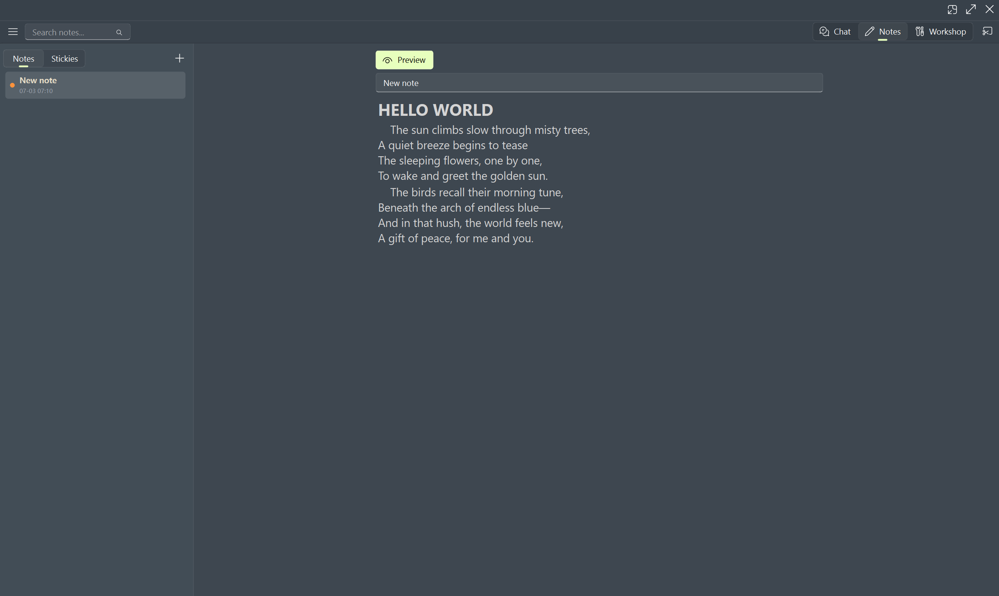
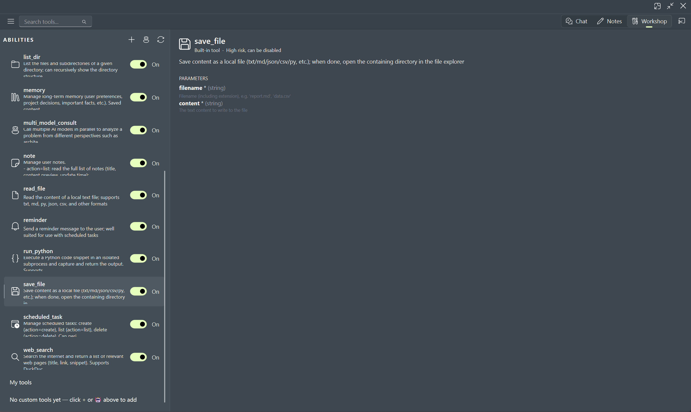
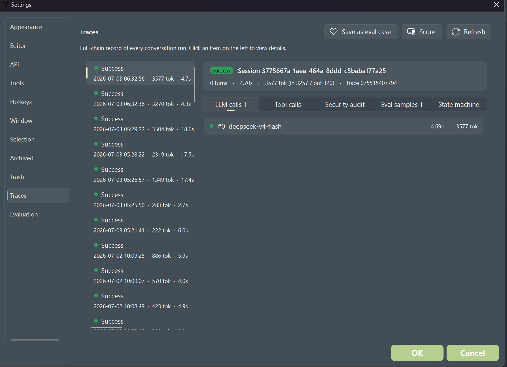
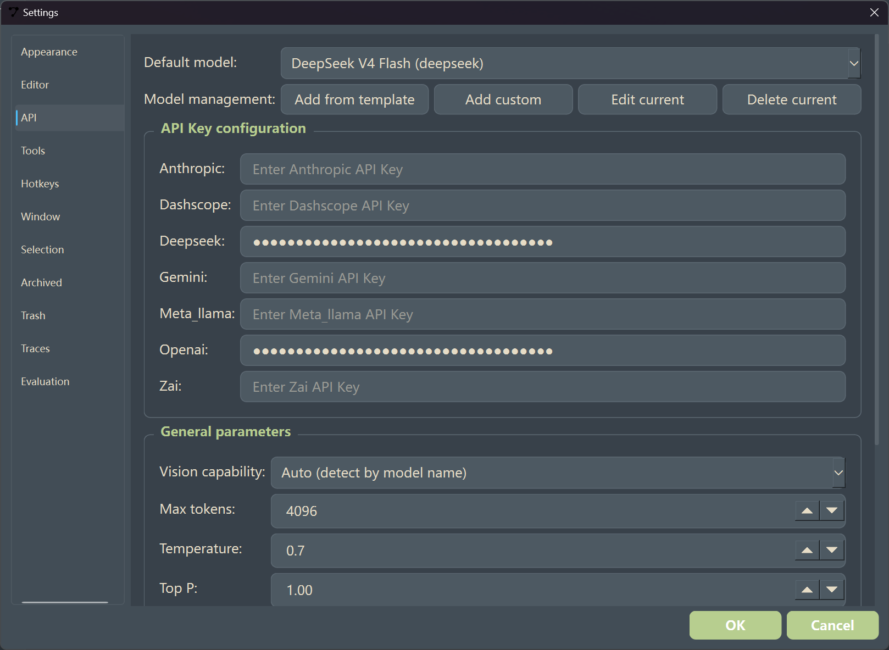

# Nemo Assistant · 桌面浮窗 AI 助手

一个常驻桌面的轻量助手，把 **划词处理、截图 OCR、Markdown 笔记、桌面便签、工具调用和 AI 对话** 收进同一个本地优先的工作流里。

它不是又一个“打开后等你聊天”的窗口，而是一组不打断当前工作的桌面小动作：读文档时顺手翻译，写内容时直接润色，看到屏幕信息就截图识别，想到事情立刻贴便签，需要时再让 AI 调工具、读笔记、记记忆。

> 基于 **PyQt6 + Fluent Design** 构建。笔记、记忆、配置与会话数据默认保存在本机；API Key 通过系统 keyring 保存，不写入明文配置。

<p align="center">
  
</p>

---

## 适合谁

- 经常在浏览器、PDF、IDE、聊天软件之间切换，需要快速翻译、解释或润色文本的人
- 想要一个本地优先的 AI 桌面助手，而不是把所有内容都搬进网页端的人
- 喜欢 Markdown 笔记、桌面便签、全局快捷键和轻量工具箱的人
- 想让 AI 能安全地调用本地工具：读写文件、搜索网页、管理笔记、记录记忆、设置提醒

---

## 核心能力

### ✏️ 划词即用

在任意应用中选中文字，Nemo Assistant 会在光标附近弹出操作条。你可以直接：

- 解释、翻译、润色、订正语法
- 把选中文本带入临时会话继续追问
- 保存到笔记库
- 将翻译、润色或订正结果写回原应用，替换原选区

选区捕获采用 UIA + 剪贴板兜底：优先直接读取，失败时才注入 `Ctrl+C`，结束后恢复剪贴板，尽量减少对当前工作的干扰。

<p align="center">
  
</p>

点击解释后，会在原位置附近弹出轻量结果卡片；看完即走，不需要把当前内容复制到单独聊天窗口里。

<p align="center">
  
</p>

划词操作条里的按钮可以在设置中按需开关；如果想围绕选中文本深入追问，可以点击继续会话或新会话按钮，内容会进入聊天界面的快速会话中留存。

<p align="center">
  
</p>

### ✂️ 截图 + OCR

按下 `Ctrl+Alt+A` 框选屏幕，即可完成截图、识别、贴图或发送给 AI 提问：

- 使用 RapidOCR / ONNX Runtime 本地识别文字
- 将截图贴在桌面上，作为临时参考
- 直接把截图交给支持视觉能力的模型分析
- 在聊天窗口右上角也可以直接点击截图按钮，入口和主聊天界面保持一致

截图能力不是外部工具的简单拼接，而是内建在浮窗工作流中：一个快捷键完成框选、识别、发送或固定到桌面。

<p align="center">
  
</p>

### 📝 笔记 & 便签

- **桌面便签**：`Ctrl+Alt+N` 新建浮动便签，内容自动保存
- **笔记本**：支持 Markdown、文件夹、标签、全文搜索、`[[双链]]` 跳转和语法高亮
- **AI 协作**：聊天中可以读取、创建、更新笔记，也能把重要内容沉淀为长期记忆

<p align="center">
  
</p>

### 🧰 工具工坊

内置工具统一展示、启用和管理；也可以加入自己的 Python 工具脚本，让 AI 在对话中按需调用。

当前内置工具覆盖：

- 网页搜索与网页抓取
- 文件读取、保存、目录遍历
- Python 代码执行
- 笔记、记忆、提醒和定时任务
- 多模型并行咨询
- 剪贴板读写

<p align="center">
  
</p>

### 🧠 可观测的 Agent 运行链路

Nemo Assistant 会记录每轮对话的关键链路，方便调试、评估和复盘：

- LLM 调用耗时、Token 消耗与输入输出统计
- 工具调用记录
- 安全审计信息
- 可保存为 eval case 的评估样本

<p align="center">
  
</p>

---

## 模型与 API

模型通过 **LiteLLM** 统一接入，支持 OpenAI、Anthropic、DeepSeek、Gemini 等服务，也支持兼容 OpenAI 接口的模型。每个模型都可以单独配置 `api_base`、视觉能力、最大 Token、温度等参数。

首次启动后，进入 **设置 → API** 添加模型并设为默认，即可启用聊天与各模块的 AI 功能。

网页搜索工具无需密钥也可以回退到 DuckDuckGo。Bing、Tavily、Brave、博查搜索可在 **设置 → 工具** 中选择 provider，并把对应 API Key 保存到系统 keyring。

<p align="center">
  
</p>

> 应用配置存放在 `config/app_config.json`（不入库），首次启动会自动生成；字段示例可参考 [`config/app_config.example.json`](../config/app_config.example.json)。

---

## 快捷键

| 快捷键 | 功能 |
| --- | --- |
| `Ctrl+Alt+Q` | 唤起快速提问 |
| `Ctrl+Alt+A` | 截图 + OCR |
| `Ctrl+Alt+N` | 新建桌面便签 |
| `Ctrl+Alt+Space` | 显示 / 隐藏主窗口 |

快捷键可在 **设置 → 快捷键** 中修改；划词浮标会在选中文字后自动出现。

---

## 快速开始

需要 Python 3.10+。

```bash
git clone https://github.com/SevenBT/nemo-assistant.git
cd nemo-assistant
pip install .
python main.py
```

开发模式推荐：

```bash
pip install -e ".[dev]"
python main.py
```

Windows 下也可以直接运行：

```bat
run.bat
```

---

## 项目结构

Nemo Assistant 采用清晰分层：桌面工具拥有独立实现，AI 层通过统一工具协议接入。

```text
main.py                  入口：依赖检查 → 崩溃日志 → 启动 Qt
│
├── app/ui/              UI 层（特色功能都有独立控制器）
│   ├── main_window          无边框浮窗主窗口（聊天 / 笔记 / 工坊）
│   ├── selection_controller 划词捕获 + 浮标
│   ├── screenshot_*         截图 overlay / OCR / 贴图
│   ├── sticky_note_*        桌面便签
│   ├── text_actions         解释 / 翻译 / 润色 / 写回选区
│   └── components/          可复用组件（消息气泡、Markdown 编辑器等）
│
├── app/core/            核心业务层
│   ├── llm_gateway          统一 LLM 网关（LiteLLM / 限流 / 重试 / 流式）
│   ├── agent_loop           Agent 状态机（prepare → stream → execute → feedback → finalize）
│   ├── note_manager         笔记 / 便签 / 待办存储（SQLite）
│   ├── memory_manager       长期记忆
│   ├── consolidator / dream 会话压缩与后台记忆整合
│   ├── scheduler            定时任务（APScheduler）
│   └── session_manager      多会话管理
│
├── app/tools/           工具系统
│   ├── registry             注册 / 发现 / 执行 / 错误分类与重试
│   ├── script_adapter       动态加载用户自定义 Python 工具
│   └── *.py                 内置工具（搜索、抓取、文件、命令、笔记、记忆等）
│
└── app/models/          数据模型（Message / Session / Note / Memory）
```

### Agent 循环

每个会话运行在独立的 `QThread` 上，互不阻塞。一个 turn 的生命周期：

```text
prepare → stream → execute → feedback → finalize
组装提示词  流式输出   并发执行工具  结果回灌   持久化会话
```

支持随时取消；发生异常后可从 checkpoint 恢复。

### 工具系统

所有工具继承 `BuiltinTool`，声明 `name / description / parameters / execute`，由 `ToolRegistry` 统一管理，并导出为 OpenAI Functions 格式。工具来源包括：

1. **内置工具**：随应用分发
2. **用户脚本**：在工具目录放入 `tool.py` 后动态加载
3. **AI 生成**：描述需求，让模型辅助生成工具代码

---

## 技术栈

- **GUI**：PyQt6 + [PyQt-Fluent-Widgets](https://github.com/zhiyiYo/PyQt-Fluent-Widgets)
- **模型接入**：LiteLLM
- **存储**：SQLite（笔记、记忆）+ JSON（会话、配置）
- **OCR**：RapidOCR（ONNX Runtime，本地识别）
- **调度**：APScheduler
- **其他**：keyring（密钥）、keyboard（全局快捷键）、BeautifulSoup（网页解析）

---

## 打包

```bat
build.bat
```

该脚本调用 PyInstaller，并使用 `Nemo_Assistant.spec` 生成桌面应用。

---

## 设计取舍

无边框浮窗、多工具融合和跨应用划词过程中踩过的一些坑，已经沉淀为当前实现方案（详见 [`docs/development-notes.md`](development-notes.md)）：

- 拖动使用 `startSystemMove()`；调整大小使用 QApplication 事件过滤器 + `setGeometry`，避免 `startSystemResize()` 的幽灵边框
- 划词时注入 `Ctrl+C` 可能误触发控制台 SIGINT，需要在外层兜底 `KeyboardInterrupt` 并还原剪贴板
- FluentWindow 会重新应用内部样式，QTextEdit 前景色需要在 `focusInEvent` 中强制设置
- 嵌入式面板的确认对话框使用原生 `QMessageBox`，不用 qfluentwidgets 的 `MessageBox`，因为 `MaskDialogBase` 要求顶层窗口

---

## 致谢

笔记编辑器的 wiki 双链解析、查找替换、Markdown 语法高亮等代码移植 / 改编自 [noteration](https://github.com/lilamr/noteration)（MIT）。完整的第三方许可证声明见 [THIRD_PARTY_NOTICES.md](../THIRD_PARTY_NOTICES.md)。

---

## License

[MIT](../LICENSE)

本项目使用了第三方开源代码，其版权与许可证声明见 [THIRD_PARTY_NOTICES.md](../THIRD_PARTY_NOTICES.md)。
